# Java Three-Tier AWS Deployment

A Java three-tier web application deployed on AWS using a custom VPC,
Nginx reverse proxy, Apache Tomcat, a pre-built WAR file, and Amazon RDS
MySQL.

> **Scope:** This project focuses on VPC networking, Linux server
> administration, reverse proxy configuration, Tomcat/WAR deployment,
> JDBC database connectivity, and CRUD application testing.\
> **Not used in this project:** ALB, Auto Scaling Group, Launch
> Template, and AMI-based scaling.

------------------------------------------------------------------------

## 1. Architecture

``` text
                         Internet
                            |
                            v
                    +----------------+
                    | Internet       |
                    | Gateway (IGW)   |
                    +----------------+
                            |
                            v
                 +----------------------+
                 | Public Subnet        |
                 |                      |
                 | Nginx Proxy Server   |
                 | Port 80              |
                 +----------------------+
                            |
                     proxy_pass
                            |
                            v
                 +----------------------+
                 | Private Subnet       |
                 |                      |
                 | Java App Server      |
                 | Apache Tomcat :8080  |
                 +----------------------+
                            |
                         JDBC
                         :3306
                            |
                            v
                 +----------------------+
                 | Amazon RDS MySQL     |
                 | Database             |
                 +----------------------+
```

### Private subnet outbound flow

``` text
Private EC2
    |
    v
Private Route Table
    |
    | 0.0.0.0/0
    v
NAT Gateway
    |
    v
Public Subnet
    |
    v
Internet Gateway
    |
    v
Internet
```

------------------------------------------------------------------------

## 2. Request Flow

1.  User opens the application URL using the public IP/DNS of the Nginx
    proxy server.
2.  The request reaches the Nginx server on port `80`.
3.  Nginx works as a reverse proxy.
4.  Nginx forwards the request to the private EC2 application server on
    Tomcat port `8080`.
5.  Tomcat serves the deployed `student.war` application.
6.  The Java application connects to Amazon RDS MySQL using JDBC.
7.  CRUD operations are performed against the `students` table.
8.  The response travels back through Tomcat → Nginx → User.

------------------------------------------------------------------------

## 3. AWS Services Used

  Service                Purpose
  ---------------------- ---------------------------------------------------
  Amazon VPC             Isolated network
  Public Subnet          Hosts Nginx proxy server
  Private Subnet         Hosts Java/Tomcat application server
  Internet Gateway       Internet connectivity for public subnet
  NAT Gateway            Outbound internet access from private subnet
  Route Tables           Control subnet traffic
  Security Groups        Control inbound/outbound traffic
  Amazon EC2             Nginx and Tomcat servers
  Amazon RDS for MySQL   Relational database
  Elastic IP             Public IP for NAT Gateway / proxy as required
  GitHub                 Stores project artifacts and source/documentation

------------------------------------------------------------------------

## 4. Prerequisites

-   AWS account
-   Basic Linux commands
-   EC2 knowledge
-   VPC networking basics
-   Java
-   Apache Tomcat
-   Nginx
-   MySQL
-   SSH access
-   GitHub repository containing:
    -   `student.war`
    -   `mysql-connector.jar`

Repository:

`https://github.com/devvikrantthakur/java-three-tier-aws-deployment`

------------------------------------------------------------------------

# 5. Create AWS VPC

Create a VPC with a suitable private CIDR block.

Example:

``` text
VPC CIDR: 10.0.0.0/16
```

Use the actual CIDR configured in your AWS account if different.

### Screenshot

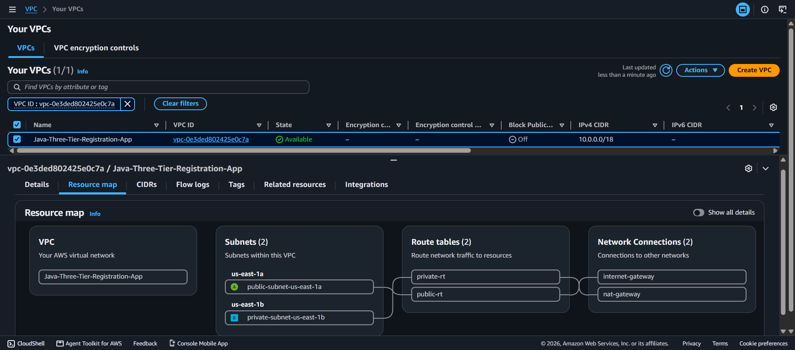

------------------------------------------------------------------------

# 6. Create Subnets

Create two subnets across Availability Zones.

Example:

``` text
Public Subnet
AZ: us-east-1a
CIDR: 10.0.1.0/24

Private Subnet
AZ: us-east-1b
CIDR: 10.0.2.0/24
```

The public subnet contains the Nginx proxy server.

The private subnet contains the Java/Tomcat application server.

### Screenshot

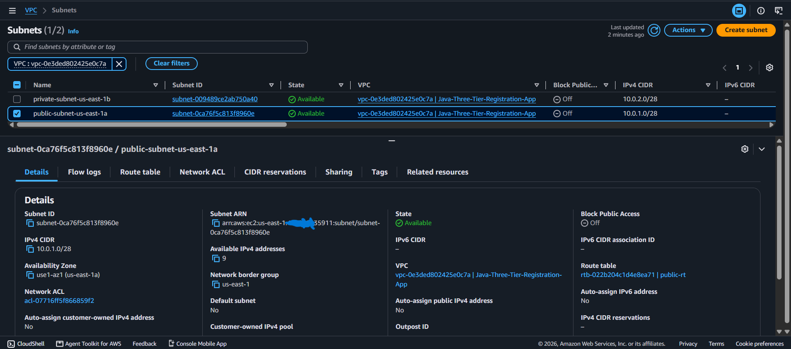


------------------------------------------------------------------------

# 7. Create Internet Gateway

Create an Internet Gateway and attach it to the VPC.

The Internet Gateway provides internet connectivity for resources in the
public subnet when the route table and security rules allow it.

### Screenshot

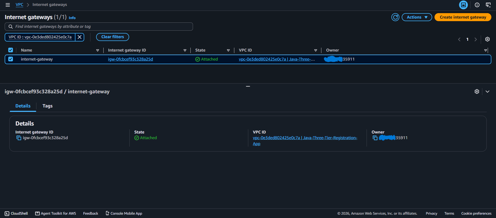

------------------------------------------------------------------------

# 8. Configure Public Route Table

Create a route table for the public subnet.

Add:

``` text
Destination: 0.0.0.0/0
Target: Internet Gateway
```

Associate the route table with the public subnet.

Expected flow:

``` text
Public EC2
    |
Public Route Table
    |
0.0.0.0/0
    |
Internet Gateway
    |
Internet
```

### Screenshot

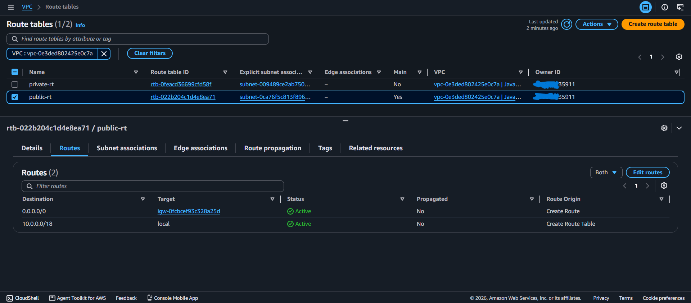


------------------------------------------------------------------------

# 9. Configure NAT Gateway

Create a NAT Gateway inside the **public subnet**.

Configuration:

``` text
Subnet: Public Subnet
Connectivity: Public
Elastic IP: New EIP
```

The NAT Gateway allows resources in the private subnet to initiate
outbound internet connections without making those private instances
directly reachable from the internet.

### Screenshot

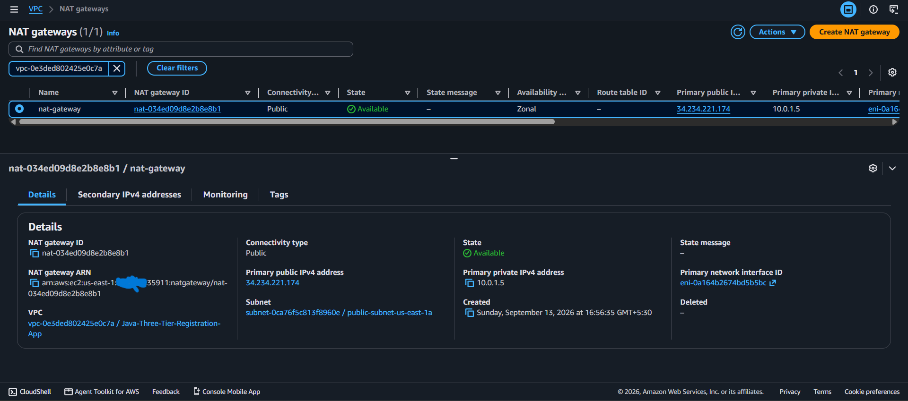

------------------------------------------------------------------------

# 10. Configure Private Route Table

Create a route table for the private subnet.

Add:

``` text
Destination: 0.0.0.0/0
Target: NAT Gateway
```

Associate this route table with the private subnet.

Expected flow:

``` text
Private EC2
    |
Private Route Table
    |
0.0.0.0/0
    |
NAT Gateway
    |
Internet Gateway
    |
Internet
```

> If AWS says that `0.0.0.0/0` already exists, edit the existing default
> route instead of creating another one.

### Screenshot

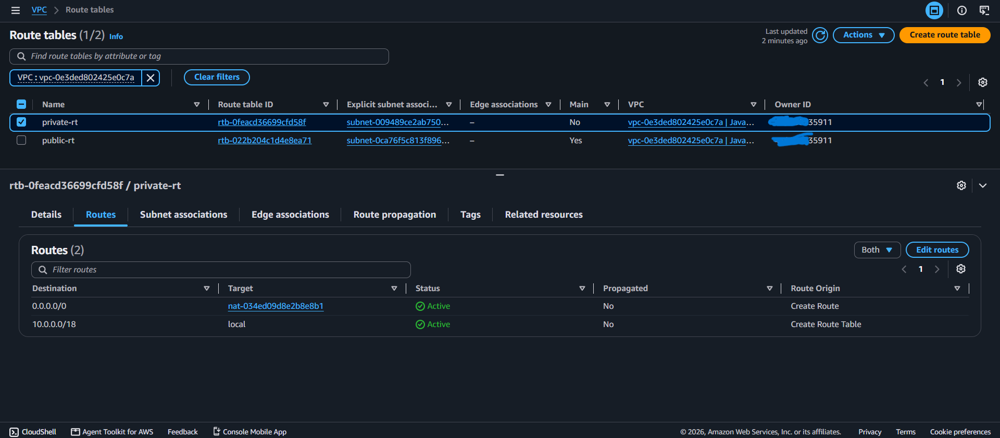
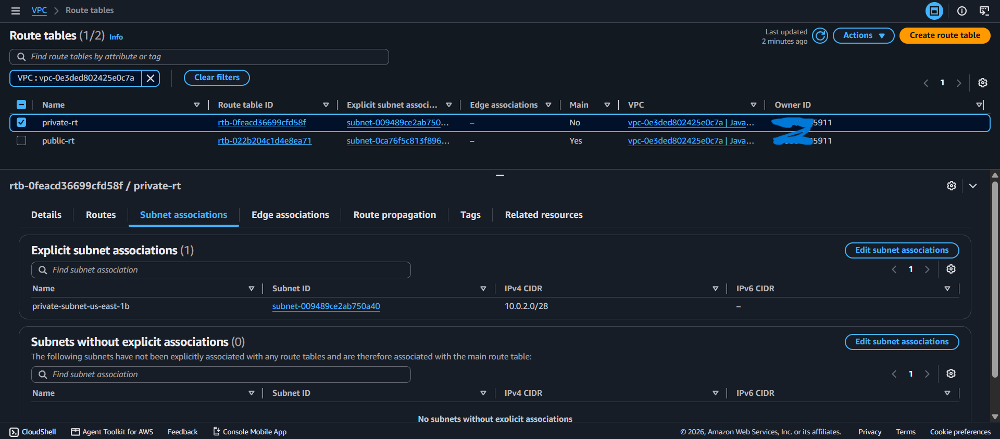

------------------------------------------------------------------------

# 11. Configure Security Groups

Create separate security groups for the proxy and application servers.

## Nginx Proxy Server Security Group

Typical lab rules:

``` text
SSH   TCP 22   Source: Your IP
HTTP  TCP 80   Source: 0.0.0.0/0
```

## Private Application Server Security Group

Typical lab rules:

``` text
SSH    TCP 22    Source: Proxy/Bastion security group or required lab source
Tomcat TCP 8080  Source: Nginx Proxy Server security group
```

The database security group should allow MySQL traffic only from the
application server security group where possible.

### Screenshot

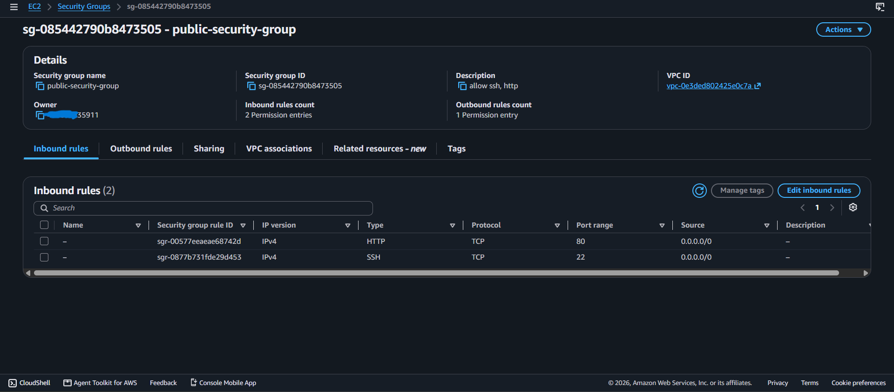
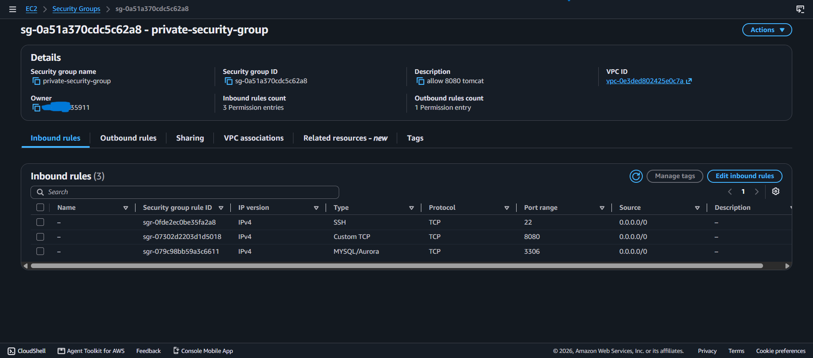

> For production, use least-privilege rules rather than broad
> `0.0.0.0/0` access.

------------------------------------------------------------------------

# 12. Launch Nginx Proxy EC2

Launch an EC2 instance in the **public subnet**.

The instance acts as the reverse proxy.

Connect using SSH:

``` bash
ssh -i <key.pem> ec2-user@<PUBLIC-IP>
```

Update packages:

``` bash
sudo yum update -y
```

Install Nginx:

``` bash
sudo yum install nginx -y
```

Check installation:

``` bash
nginx -v
```

Start Nginx:

``` bash
sudo systemctl start nginx
```

Enable Nginx at boot:

``` bash
sudo systemctl enable nginx
```

Check status:

``` bash
sudo systemctl status nginx
```

### Screenshot


------------------------------------------------------------------------

# 13. Configure Nginx Reverse Proxy

Go to the Nginx configuration directory:

``` bash
cd /etc/nginx/
```

Open the configuration:

``` bash
sudo vim nginx.conf
```

Configure the reverse proxy.

Example:

``` nginx
location / {
    proxy_pass http://BACKEND_PRIVATE_IP:8080/student/;
}
```

Example used during the lab:

``` nginx
location / {
    proxy_pass http://10.0.2.7:8080/student/;
}
```

Test configuration:

``` bash
sudo nginx -t
```

Restart Nginx:

``` bash
sudo systemctl restart nginx
```

### Screenshot

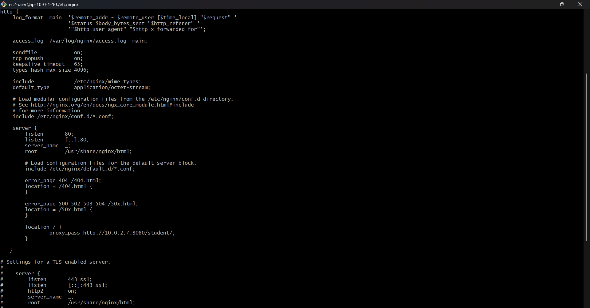

------------------------------------------------------------------------

# 14. Launch Private Application EC2

Launch another EC2 instance inside the **private subnet**.

This server hosts:

``` text
Java
Apache Tomcat
student.war
MySQL Connector
```

The application server does not need a public IP.

Connect through the configured jump/proxy access method.

### Screenshot


------------------------------------------------------------------------

# 15. Install Java

On the private application server:

``` bash
sudo yum update -y
sudo yum install java -y
```

Verify:

``` bash
java -version
```

------------------------------------------------------------------------

# 16. Install Apache Tomcat

Download Tomcat:

``` bash
sudo curl -L -O https://dlcdn.apache.org/tomcat/tomcat-9/v9.0.121/bin/apache-tomcat-9.0.121.tar.gz
```

Extract:

``` bash
sudo tar -xvzf apache-tomcat-9.0.121.tar.gz -C /opt
```

Rename the directory:

``` bash
sudo mv /opt/apache-tomcat-9.0.121 /opt/tomcat9
```

Go to Tomcat:

``` bash
cd /opt/tomcat9
```

------------------------------------------------------------------------

# 17. Start Tomcat

Enter the Tomcat binary directory:

``` bash
cd /opt/tomcat9/bin/
```

Start Tomcat:

``` bash
./catalina.sh start
```

Check whether Tomcat is listening:

``` bash
ss -lntp | grep 8080
```

Tomcat uses port:

``` text
8080
```

### Screenshot

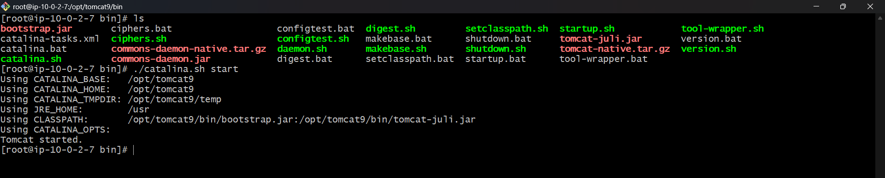

------------------------------------------------------------------------

# 18. Deploy the Pre-built WAR File

Go to the Tomcat webapps directory:

``` bash
cd /opt/tomcat9/webapps
```

Download the WAR file from GitHub:

``` bash
wget https://github.com/devvikrantthakur/java-three-tier-aws-deployment/raw/refs/heads/main/student.war
```

Verify:

``` bash
ls
```

You should see:

``` text
student.war
```

Tomcat automatically extracts the WAR into:

``` text
/opt/tomcat9/webapps/student/
```

The application context becomes:

``` text
/student/
```

### Screenshot

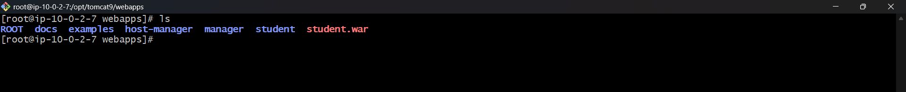
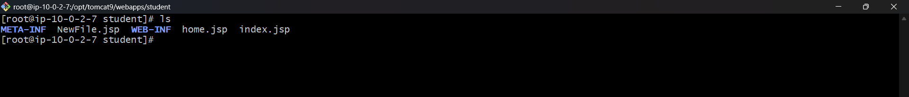

> A Tomcat restart is normally not required just for copying a new WAR
> when auto-deployment is enabled. Tomcat can detect and deploy it
> automatically.

------------------------------------------------------------------------

# 19. Create Amazon RDS MySQL Database

Create an Amazon RDS MySQL database.

Important configuration:

``` text
Engine: MySQL
Port: 3306
Database: MySQL
```

Configure the RDS security group so that MySQL access is allowed from
the application server as required.

Do not expose the database unnecessarily to the public internet.

### Screenshot

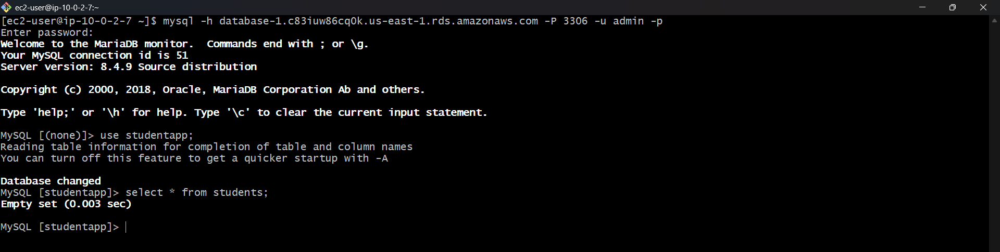

------------------------------------------------------------------------

# 20. Connect to RDS MySQL

Install the MariaDB/MySQL client if required:

``` bash
sudo yum install mariadb105-server -y
```

Connect to RDS:

``` bash
mysql -h <RDS-ENDPOINT> -P 3306 -u admin -p
```

Replace:

``` text
<RDS-ENDPOINT>
```

with your actual RDS endpoint.

------------------------------------------------------------------------

# 21. Create Database

Inside MySQL:

``` sql
CREATE DATABASE studentapp;

USE studentapp;
```

------------------------------------------------------------------------

# 22. Create Students Table

``` sql
CREATE TABLE IF NOT EXISTS students (
    student_id INT NOT NULL AUTO_INCREMENT,
    student_name VARCHAR(100) NOT NULL,
    student_addr VARCHAR(100) NOT NULL,
    student_age VARCHAR(3) NOT NULL,
    student_qual VARCHAR(20) NOT NULL,
    student_percent VARCHAR(10) NOT NULL,
    student_year_passed VARCHAR(10) NOT NULL,
    PRIMARY KEY (student_id)
);
```

Verify:

``` sql
SHOW TABLES;
```

------------------------------------------------------------------------

# 23. Install MySQL Connector

Tomcat needs the MySQL JDBC connector to communicate with RDS.

Go to:

``` bash
cd /opt/tomcat9/lib/
```

Download the connector:

``` bash
sudo wget https://github.com/devvikrantthakur/java-three-tier-aws-deployment/raw/refs/heads/main/mysql-connector.jar
```

Verify:

``` bash
ls
```

The connector is placed under:

``` text
/opt/tomcat9/lib/
```

------------------------------------------------------------------------

# 24. Verify JDBC Driver Class

The connector used in this project contains:

``` text
com/mysql/jdbc/Driver.class
```

It can be verified with:

``` bash
unzip -l /opt/tomcat9/lib/mysql-connector.jar | grep -E 'com/mysql/(jdbc/Driver|cj/jdbc/Driver).class'
```

The application configuration therefore uses:

``` text
com.mysql.jdbc.Driver
```

------------------------------------------------------------------------

# 25. Configure Tomcat Context.xml

Go to:

``` bash
cd /opt/tomcat9/conf
```

Edit:

``` bash
sudo vim context.xml
```

Configure the database resource.

Example:

``` xml
<Resource name="jdbc/TestDB"
    auth="Container"
    type="javax.sql.DataSource"
    maxTotal="500"
    maxIdle="30"
    maxWaitMillis="1000"
    username="admin"
    password="YOUR_RDS_PASSWORD"
    driverClassName="com.mysql.jdbc.Driver"
    url="jdbc:mysql://RDS-ENDPOINT:3306/studentapp?useUnicode=yes&amp;characterEncoding=utf8"/>
```

Replace:

``` text
YOUR_RDS_PASSWORD
RDS-ENDPOINT
```

with your actual values.

------------------------------------------------------------------------

# 26. Restart Tomcat After Configuration Changes

After changing `context.xml` or adding/replacing the JDBC connector,
restart Tomcat.

``` bash
cd /opt/tomcat9/bin/
```

Stop:

``` bash
./catalina.sh stop
```

Start:

``` bash
./catalina.sh start
```

This ensures Tomcat reloads the updated database configuration and
libraries.

------------------------------------------------------------------------

# 27. Verify Application

The public entry point is the Nginx proxy server.

Open:

``` text
http://<NGINX-PUBLIC-IP>/student/
```

The request flow is:

``` text
Browser
   |
   v
Nginx :80
   |
   | proxy_pass
   v
Tomcat :8080
   |
   v
student.war
   |
   | JDBC
   v
RDS MySQL :3306
```

### Screenshot

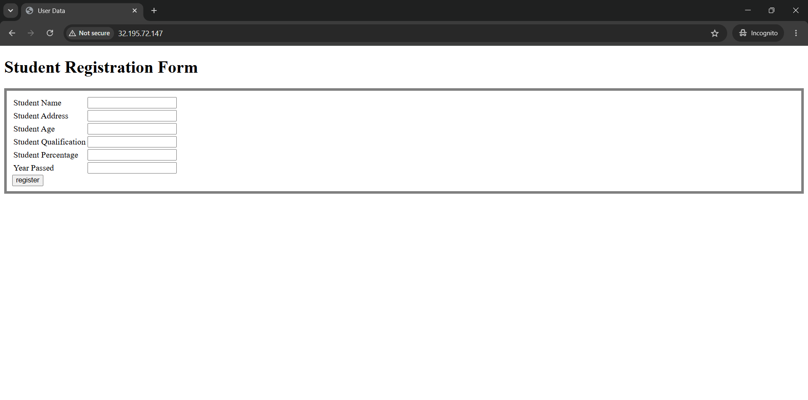

------------------------------------------------------------------------

# 28. Test CRUD Operations

The application supports database operations through the Java web
application.

Test:

-   Create/Register student
-   Read/View student records
-   Update student information
-   Delete student records

Verify records directly in MySQL:

``` sql
USE studentapp;

SELECT * FROM students;
```

### Screenshot

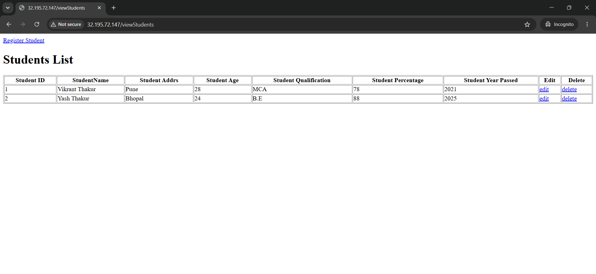
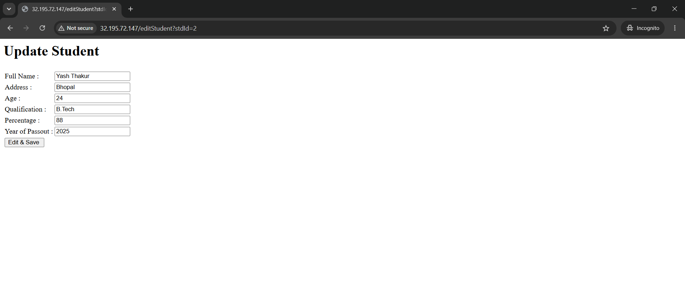
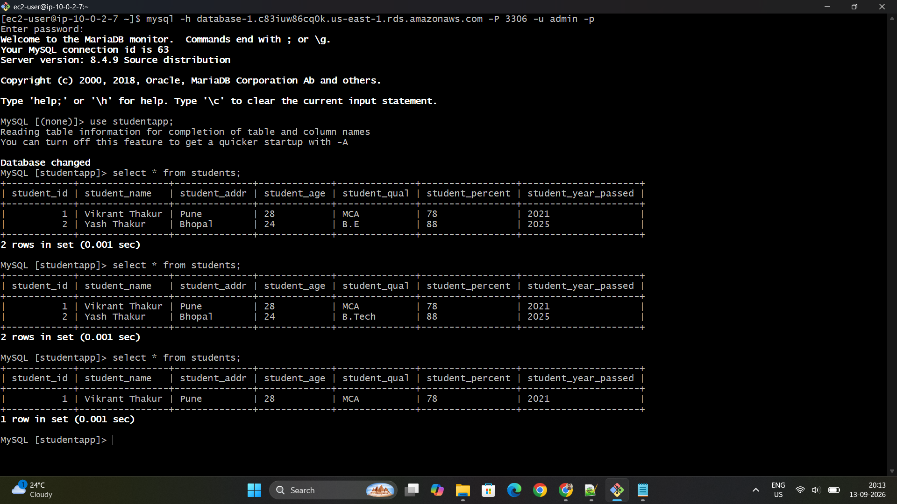

------------------------------------------------------------------------

# 29. Complete Deployment Flow

``` text
                         USER
                           |
                           | HTTP :80
                           v
                  +-------------------+
                  | Nginx Proxy EC2   |
                  | Public Subnet     |
                  +-------------------+
                           |
                           | proxy_pass
                           | Private IP :8080
                           v
                  +-------------------+
                  | Tomcat EC2        |
                  | Private Subnet    |
                  | Apache Tomcat     |
                  | student.war       |
                  +-------------------+
                           |
                           | JDBC :3306
                           v
                  +-------------------+
                  | Amazon RDS MySQL  |
                  | studentapp DB     |
                  +-------------------+
```

------------------------------------------------------------------------

# 30. Private Subnet Internet Access

The private application server can access the internet for outbound
operations through the NAT Gateway.

``` text
Private EC2
     |
     v
Private Route Table
     |
     | 0.0.0.0/0
     v
NAT Gateway
     |
     v
Public Subnet
     |
     v
Internet Gateway
     |
     v
Internet
```

The NAT Gateway does **not** make the private EC2 directly accessible
from the internet.

------------------------------------------------------------------------

# 31. Troubleshooting

## Tomcat is not running

Check:

``` bash
cd /opt/tomcat9/logs
ls
```

Check Tomcat process:

``` bash
ps -ef | grep tomcat
```

Check port:

``` bash
ss -lntp | grep 8080
```

------------------------------------------------------------------------

## Application cannot save records

Check:

1.  RDS endpoint
2.  RDS username/password
3.  Database name
4.  Table name
5.  RDS security group
6.  Application server connectivity to port `3306`
7.  MySQL connector JAR
8.  `context.xml`
9.  Tomcat logs

Test RDS connectivity:

``` bash
mysql -h <RDS-ENDPOINT> -P 3306 -u admin -p
```

Check the JDBC connector:

``` bash
unzip -l /opt/tomcat9/lib/mysql-connector.jar | grep -E 'com/mysql/(jdbc/Driver|cj/jdbc/Driver).class'
```

After changing `context.xml`, restart Tomcat:

``` bash
./catalina.sh stop
./catalina.sh start
```

------------------------------------------------------------------------

## Nginx returns 502 Bad Gateway

Check whether Tomcat is running:

``` bash
ss -lntp | grep 8080
```

Check Nginx configuration:

``` bash
sudo nginx -t
```

Check the private IP configured in:

``` nginx
proxy_pass http://BACKEND_PRIVATE_IP:8080/student/;
```

Also verify that the Nginx security group can reach port `8080` on the
application server.

------------------------------------------------------------------------

## Route already exists

If AWS displays:

``` text
The route 0.0.0.0/0 already exists
```

edit the existing default route instead of creating another one.

------------------------------------------------------------------------

# 32. Security Considerations

For a production environment:

-   Do not expose the Tomcat `8080` port to the entire internet.
-   Allow Tomcat traffic only from the Nginx/proxy security group.
-   Allow RDS `3306` only from the application server security group.
-   Avoid public access to RDS.
-   Restrict SSH `22` to trusted IPs/security groups.
-   Never upload `.pem` private keys to GitHub.
-   Never commit database passwords.
-   Mask AWS account/owner IDs in public screenshots where appropriate.
-   Use AWS Systems Manager Session Manager where possible.
-   Use HTTPS/TLS for production traffic.
-   Store secrets in AWS Secrets Manager or another secure
    secret-management system.

------------------------------------------------------------------------

# 33. Project Repository Structure

``` text
java-three-tier-aws-deployment/
│
├── student.war
├── mysql-connector.jar
├── README.md
│
└── screenshots
```

------------------------------------------------------------------------

# 34. Services/Technologies Demonstrated

### AWS

-   VPC
-   Subnets
-   Internet Gateway
-   NAT Gateway
-   Route Tables
-   Security Groups
-   EC2
-   Elastic IP
-   Amazon RDS MySQL

### Linux / Server

-   Amazon Linux
-   SSH
-   Nginx
-   Apache Tomcat
-   Java
-   Linux service/process/port troubleshooting

### Application

-   Java Web Application
-   WAR deployment
-   JDBC
-   MySQL
-   CRUD operations

### DevOps / Cloud Concepts

-   Public and private subnet architecture
-   Reverse proxy
-   Private application server
-   Database connectivity
-   NAT-based outbound connectivity
-   Linux-based application deployment
-   Basic production troubleshooting

------------------------------------------------------------------------

# 35. Important Project Scope

This project demonstrates a **three-tier deployment architecture**.

It intentionally does not include:

``` text
ALB
Auto Scaling Group
Launch Template
AMI-based Auto Scaling
ECS
Kubernetes
Terraform
Jenkins CI/CD
```

These can be added as future improvements, but they were not part of
this hands-on implementation.

------------------------------------------------------------------------

# 36. Future Improvements

Possible enhancements:

1.  Add Application Load Balancer.
2.  Add Auto Scaling Group and Launch Template.
3.  Automate WAR deployment using Jenkins.
4.  Store secrets in AWS Secrets Manager.
5.  Add HTTPS using ACM.
6.  Add Route 53 DNS.
7.  Add CloudWatch monitoring and alarms.
8.  Add CI/CD pipeline.
9.  Containerize the application using Docker.
10. Introduce Infrastructure as Code using Terraform.

------------------------------------------------------------------------

# 37. Conclusion

This project demonstrates how a Java web application can be deployed on
AWS using a secure three-tier style architecture:

``` text
Internet
   ↓
Nginx Reverse Proxy
   ↓
Private Tomcat Application Server
   ↓
Amazon RDS MySQL
```

The implementation covers AWS networking, public/private subnet design,
NAT Gateway, security groups, Linux administration, Nginx reverse proxy
configuration, Tomcat WAR deployment, JDBC configuration, RDS
connectivity, and CRUD application testing.

It provides practical hands-on experience with the core AWS and Linux
concepts required for Cloud Engineer, Cloud Support, Application
Support, and entry-level DevOps roles.
